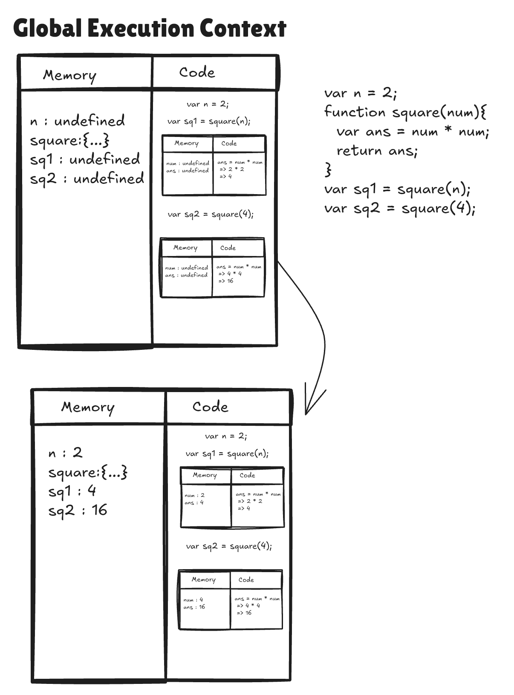
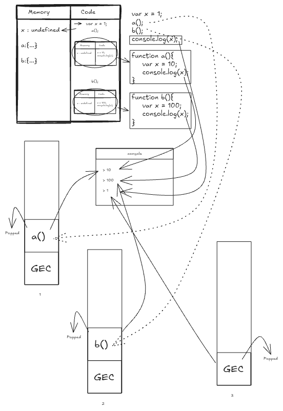
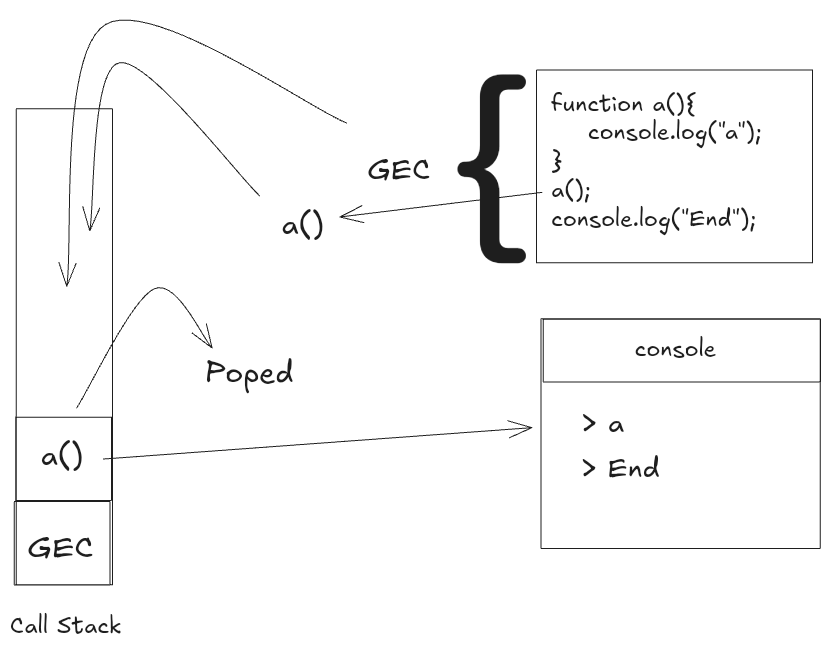
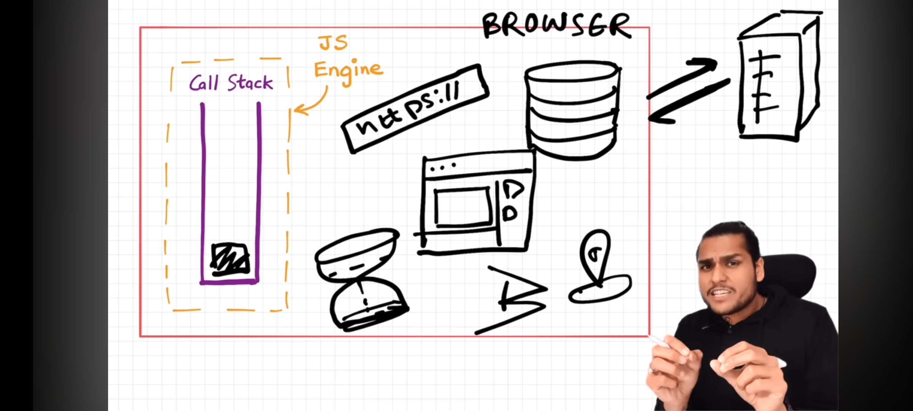
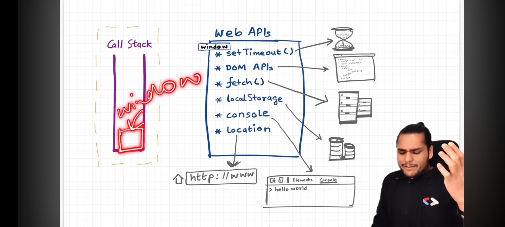
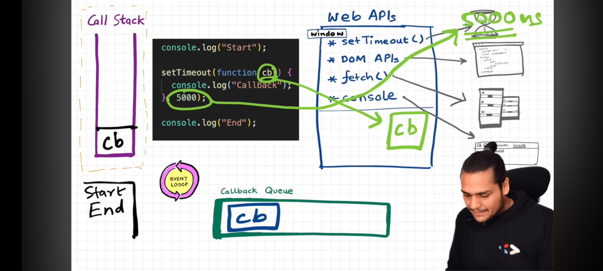
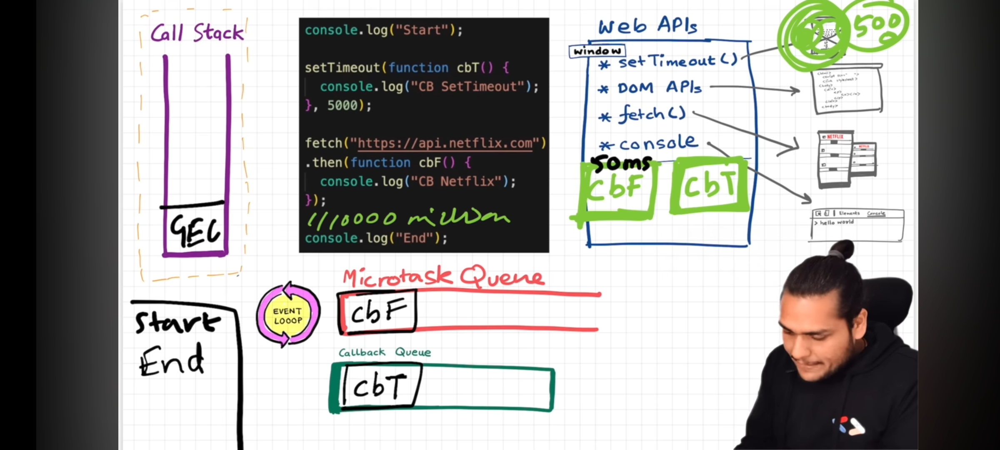

# Namaste JavaScript

## ```-> Global Execution Context```
 
 - `JavaScript is a synchronous single threaded language`
 - JavaScript Engine creates a Global Execution Context of the JavaScript file.
 - `Global Execution Context contain 2 phases`
   - `a) Memory Creation / Variable Environment`
   - `b) Code Execution / Thread Execution`
 - Memory Creation is the first phase it containes key-value pairs of variables declared in the code with a `undefined` assigned value and functions with function-name as key and the function body as the value.
 - These memory creation phase starts before actual execution of javascript file.

  
  
## ``-> Call Stack``

- JavaScript has its own `Call Stack`
- The Whole Global Execution Context is pushed into the stack for execution.
- The total execution of code is done then the call stack becomes "Empty".
- Call Stack maintains the order of execution of execution contexts.
- Call Stack is also called as `Execution Context Stack` (or) `Program Stack` (or) `Control Stack` (or) `Runtime Stack` (or) `Machine Stack`.

## ```-> Hoisting in JavaScript```

- `It is a phenomena in JavaScript by which we can access variables and call functions even before initialized it (or) invoked it without any error.`

```js
  var x = 7;
  function getName(){
    console.log("Hello");
  }
  getName();
  console.log(x);
```
console
```console
  > Hello
  > 7
```

```js
  getName();
  console.log(x);
  var x = 7;
  function getName(){
    console.log("Hello");
  }
```
console
```console
  > Hello
  > undefined
```

> [!NOTE]
> Even before Executing the code Memory will be allocated for each and every variable in javascript.

## ```-> How the Function work in JavaScript```



## ```-> Shortest JavaScript Program```

- `Empty JavaScript file` either it may be empty but javascript engine will do a lot of work.
- Even though there is nothing to execute but still it creates Global Execution Context (GEC) and setups the Memory Space.
- JavaScript Engine Creates `window object` - global object created along with GEC - looks like a big object with lot of variables and functions.
- JavaScript Engine also creates `this` keyword. - at global level `this` represents `window` object.

> [!NOTE]
> At the global level `this === window`.

```js
  var a = 10;
  function b(){
    var x = 15;
  }
  console.log(a);
  console.log(window.a);
  console.log(this.a);
```
console
```console
  > 10 
  > 10
  > 10
```

## ```-> Undefined vs not dfined in JavaScript```

- Memory creation process is happend before the code execution process. It stores variables and functions as a key-value pairs.
- In Memory creation process - It picks the variables & functions, for the variables variableName(keys) it assaigns a specifier called as `undefined`(value), for the functions functionName(keys) it assaings the body of the function(value).
```js
  console.log(a);
  var a = 10;
  console.log(a);
```
console 
```console
  > undefined
  > 10
```
  - In phase 1(`Memory Creation`): It stores variables as keys and a specifier `undefined` as their value, for the functions functionName as key and function body as value.
  - In phase 2(`Code Execution`): Where code execution actually starts.

As come to `not defined`
```js
  console.log(a);
  var a = 10;
  console.log(a);
  console.log(x);
```
console
```console
  > undefined
  > 10
  Reference Error (x is not defined)
```

## ```-> The Scope chain, Scope & Lexical Environment```

- `Scope` : Where we can access a specific variable (or) function inside our code.
- Scope is directly depends on the Lexical Environments.
- Scope of a variable is directly dependent on the lexical environment.
- Whenever an execution context is created, a lexical environment is created. Lexical environment is the local memory along with the lexical environment of its parent. Lexical as a term means in hierarchy or in sequence.
- Having the reference of parent's lexical environment means, the child or the local function can access all the variables and functions defined in the memory space of its lexical parent.
- The JS engine first searches for a variable in the current local memory space, if its not found here it searches for the variable in the lexical environment of its parent, and if its still not found, then it searches that variable in the subsequent lexical environments, and the sequence goes on until the variable is found in some lexical environment or the lexical environment becomes NULL.
- The mechanism of searching variables in the subsequent lexical environments is known as Scope Chain. If a variable is not found anywhere, then we say that the variable is not present in the scope chain

## ```-> Let, Const & Temporal Dead Zone```

- let and const are hoisted. we can't use them before initialization is result of "temporal dead zone".
- `Temporal Dead Zone` -Time since when let/const variable is hoisted and till when it is initialized to a value.
- js use diff memory than global execution context to store let and cost. which is reason behind "temporal dead zone"
- level of strictness ... var<<let<<const.
- var //no temporal dead zone, can redeclare and re- initialize, stored in GES
- let //use TDZ, can't re-declare, can re-initialize, stored in separate memory
- const //use TDZ, can't re-declare, can't re-initialize, stored in separate memory
- syntax error is similar to compile error. while type and reference error falls under run time error. -
- syntax error... violation of JS syntax
- type error... while trying to re-initialize const/let variable
- reference error... while trying to access variable which is not there in global memory.

## ```-> Block Scope and Shadowing```

- Code inside curly bracket is called block.
- Multiple statements are grouped inside a block so it can be written where JS expects single statements like in if, else, loop, function etc.
- Block values are stored inside separate memory than global. They are stored in block. (the reason let and const are called block scope)
- Shadowing of variables using var, let and const.
- The shadow should not cross the scope of original otherwise it will give error.
- shadowing let with var is illegal shadowing and gives error.
- var value is stored in nearest outer function or global scope and hence can be accessed outside block as well whereas same is not the case with let and const.

## ```-> Closures```

- `Closures` : A function bind together with its Lexical Scope.
- Combination of a function bundled together with references to its surrounding state.
- Gives access to an outer function scope from an inner function.

```js
  function x(){
    var a = 7;
    function y(){
      console.log(a);
    }
    return y;
  }
  x();
```
console
```console
  > 7
```
  - Closures are used in :
    - Module Design Pattern
    - Currying
    - Functions like once
    - Memorize
    - Maintaining state in async world
    - setTimeOuts
    - Iterators etc.,

## ```-> setTimeOut & Closures```

```js
  function x(){
    var i = 1;
    setTimeOut(function(){
      console.log(i);
    }, 3000);
    console.log("Namaste Js")
  }
```
console
```console
  > Namaste Js
  > 1
```

## ```-> Functions```

1.  What is Function Statement ?
A.  A normal function that we create using Naming convention. & By this we can do the Hoisting.
For Ex  -  
```js
  function xyz(){
    console.log("Function Statement");
  }
  ```

2.  What is Function Expression ?
A.  When we assign a function into a variable that is Function Expression. & We can not do Hoisting by this becz it acts like variable.
For Ex - 
```js
  var a = function(){
    console.log("Function Expression");
  }
```

3.  What is Anonymous Function ?
A.  A Function without the name is known as Anonymous Function. & It is used in a place where function are treated as value.
For Ex - 
```js
  function(){
  }
```

4.  What is Named Function Expression ?
A.  A function with a name is known as Named Function Expression.
For Ex - 
```js
  var a = function xyx(){
    console.log("Names Function Expression");
  }
  ```

5.  Difference b/w Parameters and Arguments ?
A.  When we creating a function & put some variabels in this ( ) that is our Parameters.
For Ex - 
```js
  function ab(param1, param2 ){
    console.log("
  }
  ```
& When we call this function & pass a variabel in this ( ) that is our Arguments
For Ex - 
```js
  ab( 4, 5 );
```

6.  What is First Class Function Or First class citizens?
A.  The Ability of use function as value,
  * Can be passed as an Argument,
  * Can be executed inside a closured function &
  * Can be taken as return form.
For Ex - 
```js
  var b = function(param){
    return function xyz(){
      console.log(" F C F ");
    }
  } 
  ```

7. Function are heart of JS. They are called first class citizens or first class functions because they have the ability to be stored in the variables, passed as parameters and arguments. They can also be returned in the function

## ```-> Callback Functions```

1. Function that is passed on as argument to another function is called `callback function`.
2. Event listeners can also invoke closures with scope.
3. Event listeners consume a lot of memory which can potentially slow down the website therefore it is good practice to remove if it is not used.

## ```-> Garbage Collection & removeEventListeners```

  - Event Listeners can also invoke clousers with scope.
  - Event Listeners consumes lot of memory which can potentially slow down the website therefore it is good practice to remove if its not used.
  - `setTimeout` doesnot help to convert from sync to async. Actually the first class functions helps JavaScript to convert from 'sync' to 'async'

## ```-> Event Loop```

  
  
  - After completing tasks inside of a's Execution Context it will be popped out of the call stack.
  - Completing Execution of whole program code it popsout the `Global Execution Context`, now the call stack becomes empty.
  
  
  
  - Browser has super powers that are lent to JavaScript Engine to execute some tasks, these super powers include:
  - Web API's 
    - `console`
    - `DOM API`
    - `setTimeout`
    - `fetch`
    - `local storage`
  
  

  - Callback functions and Event Handlers are first stored in Web API environment and then transfered to `callback queue`.

  
  
  - `Promises` and `Mutation Observer` are stored in API environment and then transfered to `microtask queue`.
  - `Event Loop` continuosly observes callstack and when it is empty it transfers task to `call stack`.
  - `Microtask queue` is given priority over `callback tasks`.
  - Too many microtasks generated can cause `Starvation` - Not giving time to callback tasks to execute.
  
  

## ```-> JavaScript Runtime Environment```


